# Ancy Togo CTF 2023

Follow me on Twitter : [RAVEN AM1](https://twitter.com/w31rdr4v3n/)

## reverse

Binary file: [Here](datas/lab32)
Here's the source code of the main obtained with ghidra.

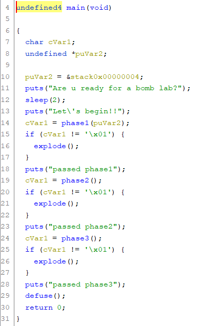

The code starts by displaying the texts, then a ```phase1(puVar2)``` function is called.

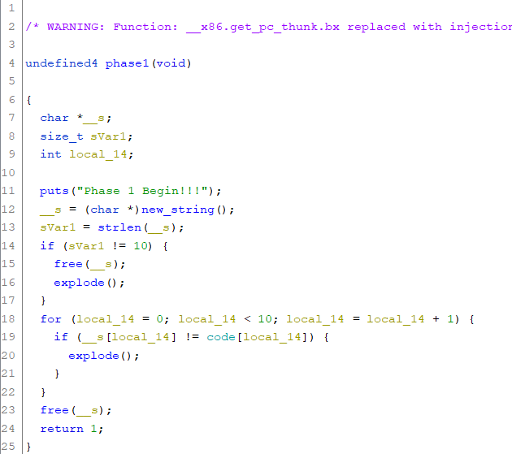

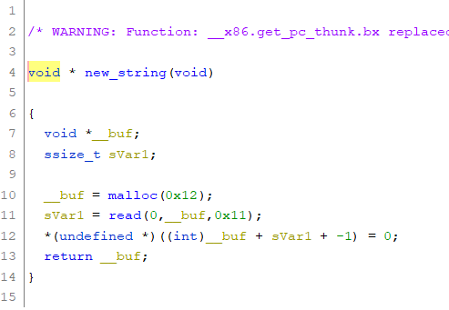

Inside the ```phase1(puVar2)``` function, we have the ```new_string()``` function, which takes a string as input.
It checks whether the string size is equal to 10, otherwise it stops the program with the ```explode()``` function.

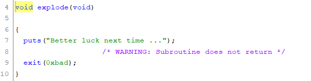

After checking the string size, the ```__s``` string is compared with the code string. If it doesn't match, the program stops.
Here's the value of the ```code``` string:

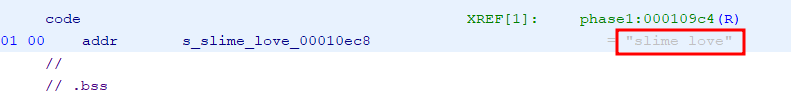

```c
code[] = "slime love"
```

To pass this phase1, just send the ```slime love``` string as input.

** Phase2

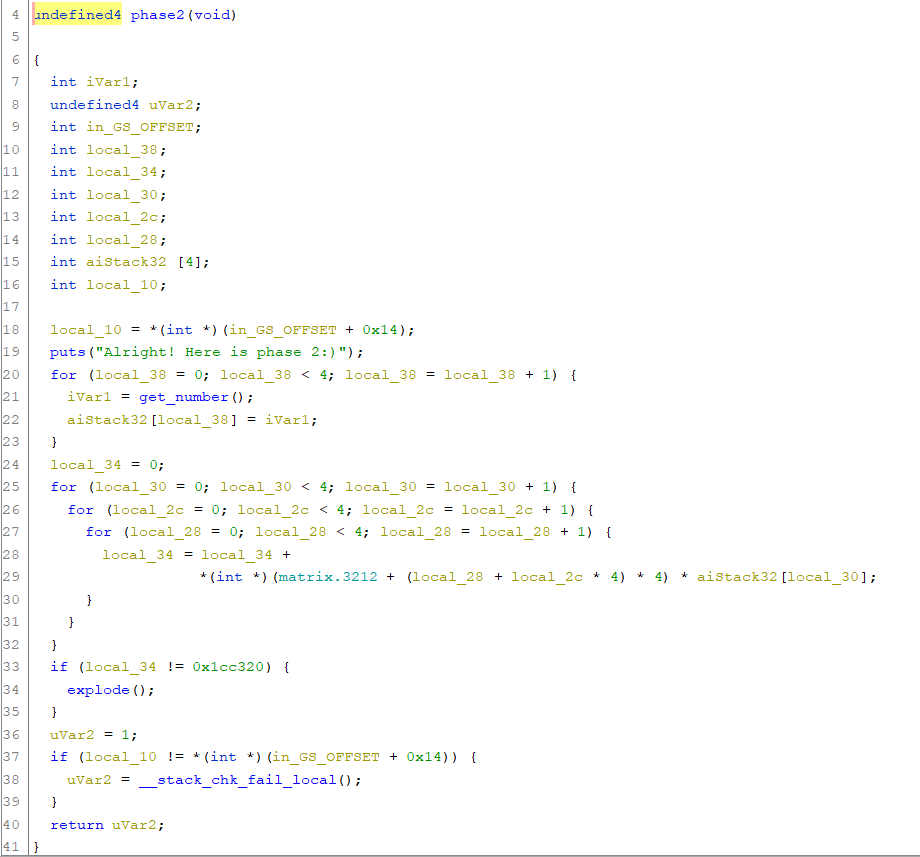

Using a for loop, it takes 4 input numbers and inserts them into an ```aiStack32``` integer array.
Then, each value in the ```aiStack32``` array is multiplied by each value in the two-dimensional array ```matrix.3212```.

The contents of ```matrix.3212```

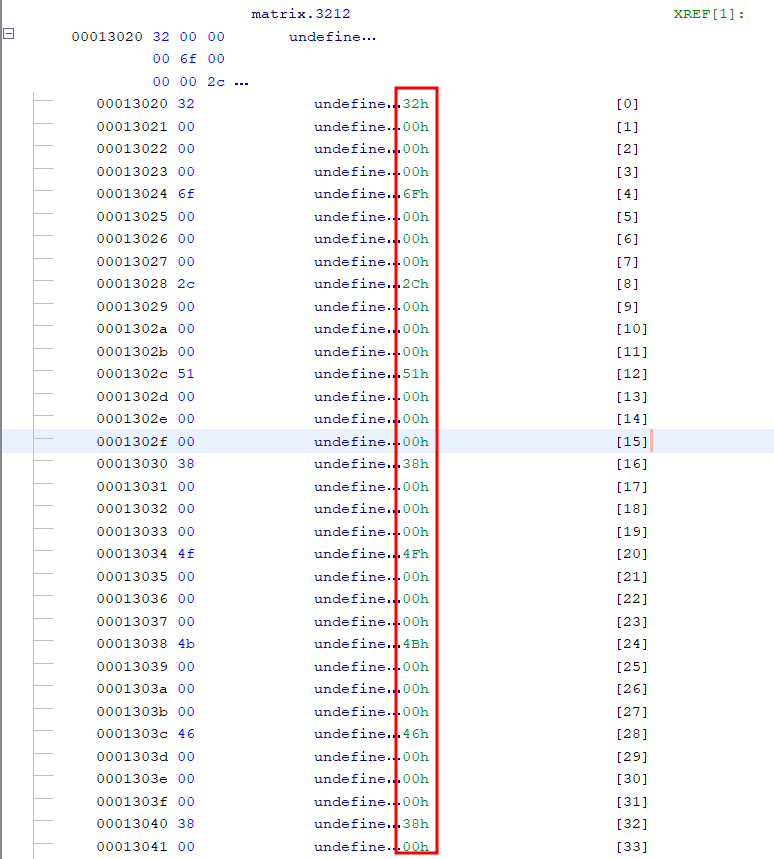
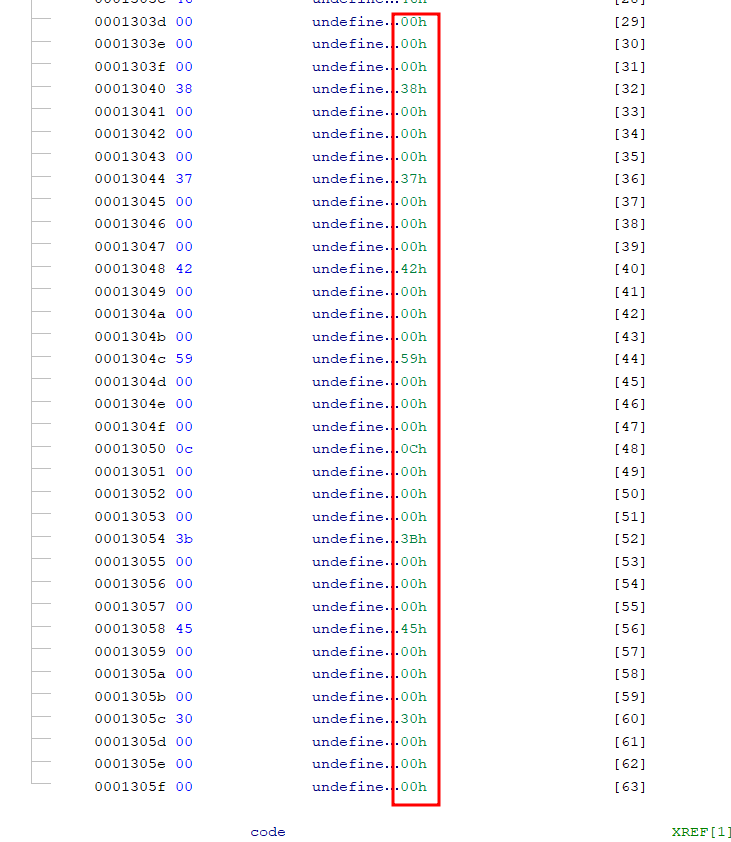

The code :

```c
int matrix[4][4] = { {0x32,0x6f,0x2c,0x51}, {0x38,0x4f,0x4b,0x46}, {0x38,0x37,0x42,0x59}, {0x0c,0x3b,0x45,0x30}};


  int local_34 = 0;
  for (int local_30 = 0; local_30 < 4; local_30 = local_30 + 1) {
    for (int local_2c = 0; local_2c < 4; local_2c = local_2c + 1) {
      for ( int local_28 = 0; local_28 < 4; local_28 = local_28 + 1) {
        local_34 = local_34 + matrix[local_2c][local_28] * aiStack32[local_30];
      }
    }
  }
 ```
The mathematical formula is as follows:

```c
aiStack32[4] = {x,y,z,t}

local_34 = x*(0x32 + 0x6f + 0x2c + 0x51 + 0x38 + 0x4f + 0x4b + 0x46 + 0x38 + 0x37 + 0x42 + 0x59 + 0x0c + 0x3b + 0x45 + 0x30) 
	 + t*(0x32 + 0x6f + 0x2c + 0x51 + 0x38 + 0x4f + 0x4b + 0x46 + 0x38 + 0x37 + 0x42 + 0x59 + 0x0c + 0x3b + 0x45 + 0x30)
	 + z*(0x32 + 0x6f + 0x2c + 0x51 + 0x38 + 0x4f + 0x4b + 0x46 + 0x38 + 0x37 + 0x42 + 0x59 + 0x0c + 0x3b + 0x45 + 0x30)
         + t*(0x32 + 0x6f + 0x2c + 0x51 + 0x38 + 0x4f + 0x4b + 0x46 + 0x38 + 0x37 + 0x42 + 0x59 + 0x0c + 0x3b + 0x45 + 0x30)

local_34  = (0x32 + 0x6f + 0x2c + 0x51 + 0x38 + 0x4f + 0x4b + 0x46 + 0x38 + 0x37 + 0x42 + 0x59 + 0x0c + 0x3b + 0x45 + 0x30)*( x + y + z +t)

local_34  = 1020*( x + y + z + t)
```

As we want ```local_34``` to be equal to ```0x1cc320``` in order to pass ```phase2```, we will transform the equation into this:

```c
0x1cc320 = 1020*( x + y + z + t) 
         or
x + y + z + t = 1848
```

This equation has several solutions, one of which is ```(x=1848, y=0, z=0, t=0)```.

You can find all the solutions to this equation using this code I wrote with ```z3```.

```python
from z3 import *
x=Int('x')
y=Int('y')
z=Int('z')
t=Int('t')
s=Solver()    
s.add(x + y + z + t == 1848)

s.check()
while(s.check()==sat):
	print(s.model()[x])
	print(s.model()[y])
	print(s.model()[z])
	print(s.model()[t])
	input("Another..")
```

So, for the second phase, we have to send the numbers ```1848, 0, 0, 0``` as input.

** Phase3

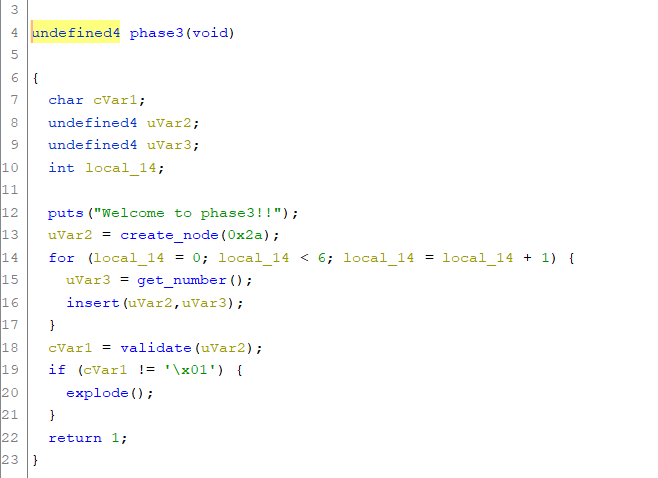

For this phase, 6 numbers are retrieved in a for loop, added to a node(struc) and then inserted into a string list.

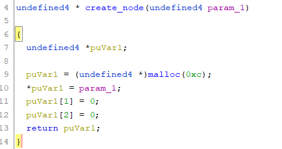

Each node has three variables, and can be represented as follows.

```c
Node* create_node(undefined4 value) {
    Node* newNode = (Node*)malloc(sizeof(Node));
    if (newNode != NULL) {
        newNode->value = value;
        newNode->left = NULL;
        newNode->right = NULL;
    }
    return newNode;
}
```

Insertion is based on a rule.

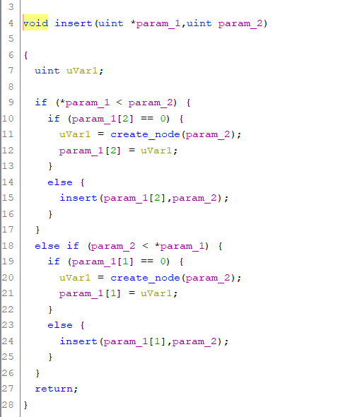

If the value retrieved from the input is greater than the value of the previous node, we create a new node and add it to the right variable of the previous node, otherwise we add it to the left variable of the previous node.

If the right or left variable of the previous node already contains another node, we move to this node, and so on, until we come to the last node to add the new node.

Then there's the validation function, which checks the order of node values.

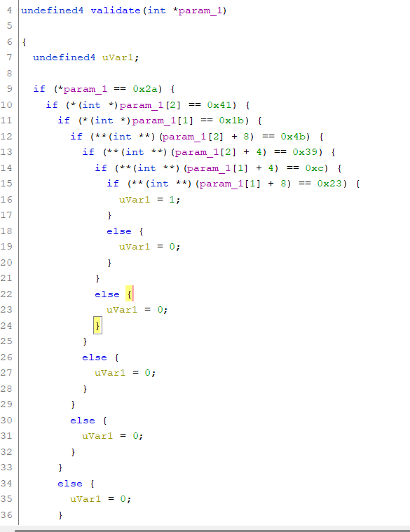

To validate, send the values in the following order: ```27 -> 65 -> 12 -> 35 -> 57 -> 75```

J'ai ecrit un code pour le resoudre:

```python
from pwn import *

sh = remote("0.cloud.chals.io", 29115)

#phase 1
print(sh.recv().decode())
print(sh.recv().decode())

sh.sendline(b"slime love")

print(sh.recv().decode())

#phase 2

for _ in [b"1848", b"0", b"0", b"0"]:
	sh.sendline(_)

print(sh.recv().decode())

#phase3

for _ in [b"27", b"65", b"12", b"35", b"57", b"75"]:
	sh.sendline(_)
	

print(sh.recv().decode())
```

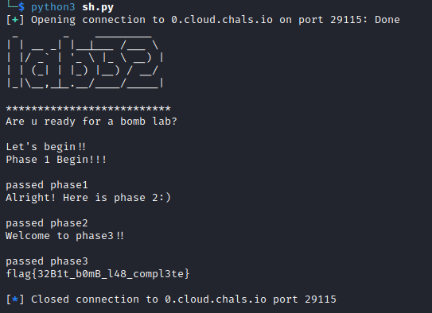

## Crypto

File : [Here]()

I've written this code to extract the n and the e.

```python
from Crypto.PublicKey import RSA
from Crypto.Util.number import *

pubkey = RSA.importKey(open("key.pub").read())
e = pubkey.e
n = pubkey.n

print("e :", e)
print("n :", n)
```

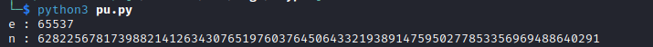

The n is small, so I factorized it using dcode.

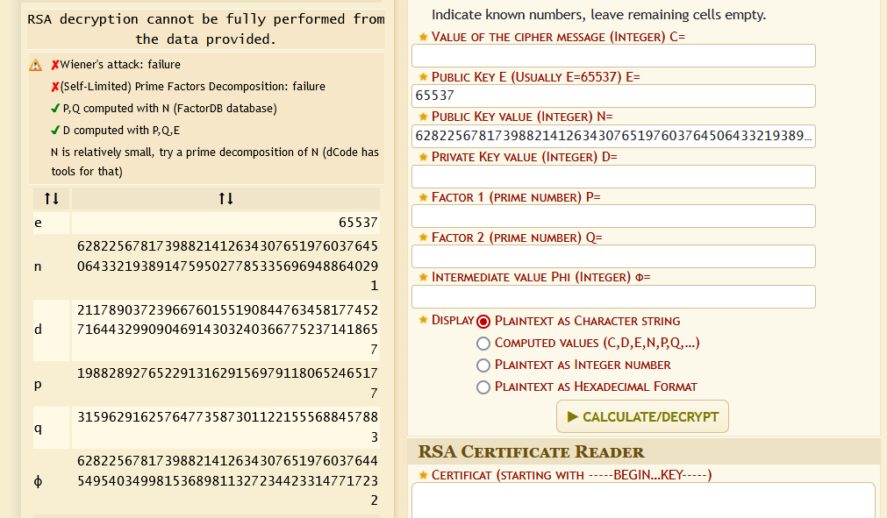

I now have the d.
I wrote this code to decipher the flag.

```python
from Crypto.PublicKey import RSA
from Crypto.Util.number import *

pubkey = RSA.importKey(open("key.pub").read())
e = pubkey.e
n = pubkey.n

flag = ""
d =	21178903723966760155190844763458177452716443299090469143032403667752371418657


print("e :", e)
print("n :", n)
print("d :", d)

for _ in ["key0.enc","key1.enc","key2.enc","key3.enc"]:
	with open(_, "rb") as f:
		cipher = f.read()
		c = bytes_to_long(cipher)
		flag += long_to_bytes(pow(c, d, n)).decode()

print(f"\nFLAG: {flag}")

```

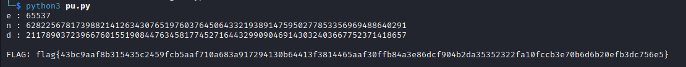
