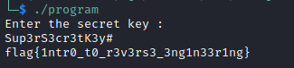
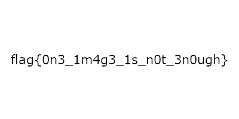
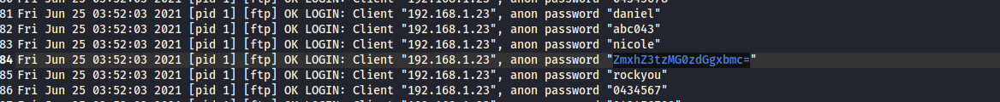

# Crypto

### A simple challenge

You can use [CyberChef](http://icyberchef.com) and decode it six times or use the base64 command to decode it.

```bash
base64 -d <<<"Vm0weE1HRXlTWGxVYTJoVllXeGFVMWx0ZEV0alZuQlhWbXQwYVUxVk5WZFpWVlUxWVZaS2RHUkVXbFpOYWtVd1dWUkdSbVF4VG5GUmJHaHBVakpvVVZkc1pEUmpNV1JIWTBWb2JGSnJTbTlXYkZaM1RVWmtXR1JIZEZOTmEzQXdWbTF3WVZaWFNuTlhiVVpoVmpOU1RGa3llRk5XTVd3MlVtMXNhVkl5WTNsV1Z6QXhaREZrVmsxWVJsWmhhelZvVld4YWNrMUdjRmhOVlhSclVteEtNVmxyWkRSWFJrcFdZa1JPVjFKc2NGUlZWRXBUVm0xS1IySkZOVk5TUlVVMQ==" | base64 -d | base64 -d | base64 -d | base64 -d | base64 -d
```

### Roman encryption 
```bash
Csddk Rtdetp,
Qcghb ykt jko ykto ptmmkoq,
Ykt igh tps qcep bsy qk osisevs ykto oswgou: jdgl{5ta5q1qtq10h_1p_b3y}
```
I used [quipqiup](https://www.quipqiup.com/) to decode it.

```
Hello Julius, Thank you for your support, You can use this key to receive your reward: flag{5um5t1tut10n_1s_k3y}
```


Change m by b in flag.

```bash
flag{5ub5t1tut10n_1s_k3y}
```

### Hextraordinary security
Attached file **[here](datas/garbage)**
You can use [CyberChef](http://icyberchef.com) to decode the hex and find flag inside garbage with CTR+F or use xxd.

```bash
xxd -r -p <<<"hex_data_here" | grep flag
```


# Reverse

### You are not allowed 
Attached file **[here](datas/program)**
I ran the executable to see how it works and that asks me a secret key.


So I used ltrace to see more clearly, functions called during execution.


As I have the secret key I restart the executable and I put it.




# Forensic


### Hiding in plain sight 
Attached file **[here](datas/hackerman.png)**
```bash
strings hackerman.png | grep flag
```


### Welcome to the challenge 

Attached file **[here](datas/rcts_challenge.jpg)**

```bash
foremost rcts_challenge.jpg
```

In the output/png directory we find the hidden image.




### About us

Attached file **[here](datas/RCTSCERT-FCCN.pdf)**

```bash
strings RCTSCERT-FCCN.pdf | grep flag
```


### Keyp it universal

Attached file **[here](datas/capture.pcap)**
```bash
tshark -r capture.pcap  -T fields -e usbhid.data -Y "usbhid.data" | sed 's/../:&/g2' > data
```
data file **[here](datas/data)**


```bash
usbkeyboard data
```


# Mission

### Something Suspicious 
  Attached file **[here](datas/ftp.log)** and **[here](datas/ssh.log)**
  In ftp.log

And in ssh.log


.

